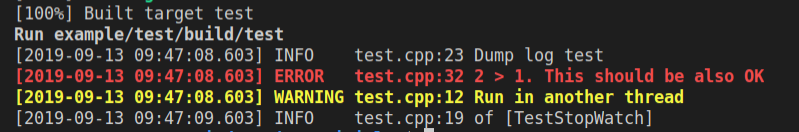

# Learn

## 1. 自动化编译并执行test
## 1.1 执行python build.py:   
> 1. 生成 example/test/build/test;   
> 2. 生成库libminiglog.so(dylib)供test调用;   
> 3. 执行test，并打印log   

## 1.2 build.py中一些切换目录，执行cmd的语句值得借鉴：     
```
    curr = os.getcwd() #get 当前所在位置的全路径   
    os.chdir(self.path) #切换路径   
    os.path.exists(build_folder) #判断路径是否存在   
    shutil.rmtree(build_folder) #删除文件夹   
    os.mkdir(build_folder)  #新建文件夹   
    os.sys.exit(1) #退出程序   
    cmd(cmdlist): #相当于shell中执行列表cmdlist中的一些列命令行。
```


## 2. 用法:
参考下文的Usage


## 4. 主要修改
> 1. CMakeLists.txt中，加上了对Mac系统的支持。
```
set(MINIGLOG_LIBS ${ROOT_PATH}/build/lib/libminiglog.dylib) #libminiglog.dylib for Mac;libminiglog.so for Linux.
```
> 2. 暂时注释掉了pid,tid在log中的显示。
```
    //SONG: uncomment below line can print pid, tid in log .
    // sprintf(tid_cstr, "%d/%u ", pid, tid);
```
效果:


## 3. 其他

```
  DLOG(INFO) << "of [" << __func__ << "]"; //Log内容为当前的函数名    
  LOG_IF(ERROR, x > y) << "2 > 1. This should be also OK"; //如果x>y满足，才能打印log   
```


********************************************************

# miniglog

[](https://travis-ci.org/tzutalin/miniglog)

A logging C++ library based on the miniglog library found in ceres-solver.

Let people include and build c++ logging quickly

I update the original miniglog because it won't show pid/tid/timestamp.

### Benefits
* Very small (less than 1000 LOC)
* Easy to use
* No 3rd-party dependencies
* Cross-platform
* Same interface as glog
* Marcos to measure time taken by a function
### Grab the source
```
    $ git clone https://github.com/tzutalin/miniglog.git
```
### Build examples
```
    Need to setup cmake and android ndk first
    $ cd miniglog

    Build for desktop
    $ python build.py

    Build for Android
    $ python build.py --ndk ${ANDROID_NDK} --abi arm64-v8a

    Add --ninja to build with ninja
    $ python build.py --ninja
    $ python build.py --ninja --ndk ${ANDROID_NDK} --abi x86
```

### Usage
- Incllude #include <glog/logging.h> to your files
- LOG Level: FATAL ERROR WARNING INFO

- Logging Macro
```
    LOG(INFO) << "msg";
    LOG(ERROR) << "error msg";
    LOG(FATAL) << "fatal msg";

    // Debug only version
    DLOG(INFO) << "msg";
    DLOG(ERROR) << "error msg";
    DLOG(FATAL) << "fatal msg";
```
- CHECK_OP macros
```
    CHECK(condition)
    CHECK_EQ(val1, val2) CHECK_OP(val1, val2, ==)
    CHECK_NE(val1, val2) CHECK_OP(val1, val2, !=)
    CHECK_LE(val1, val2) CHECK_OP(val1, val2, <=)
    CHECK_LT(val1, val2) CHECK_OP(val1, val2, <)
    CHECK_GE(val1, val2) CHECK_OP(val1, val2, >=)
    CHECK_GT(val1, val2) CHECK_OP(val1, val2, >)
    CHECK_NEAR(val1, val2, margin)

    // Debug only versions of CHECK_OP macros.
    DCHECK(condition)
    DCHECK_EQ(val1, val2)
    DCHECK_NE(val1, val2)
    DCHECK_LE(val1, val2)
    DCHECK_LT(val1, val2)
    DCHECK_GE(val1, val2)
    DCHECK_GT(val1, val2)
    DCHECK_NEAR(val1, val2, margin)
```
- CHECK_NOTNULL macros
```
    CHECK_NOTNULL(val);
    // Debug version only
    DCHECK_NOTNULL(val);
```

### Sample code
```
pthread_t newTid;

void *ThreadRunnable(void *arg) {
  LOG(WARNING) << "Run in another thread";
  return ((void *)0);
}

void TestStopWatch() {
  int *ptr = new int[10];
  CHECK_NOTNULL(ptr);
  DLOG(INFO) << "of [" << __func__ << "]";
}

int main() {
  LOG(INFO) << "Dump log test";

  // CHECK Operation
  CHECK_NE(1, 2) << ": The world must be ending!";
  // Check if it is euqual
  CHECK_EQ(std::string("abc")[1], 'b');

  int x = 2;
  int y = 1;
  LOG_IF(ERROR, x > y) << "2 > 1. This should be also OK";

  // Test dump log in different thread
  int err = pthread_create(&newTid, NULL, ThreadRunnable, NULL);
  if (err != 0) {
    LOG(FATAL) << "Unable to create a thread";
    return 1;
  }
  sleep(1);
  TestStopWatch();
  return 0;
}
```
Output:


### Import for Android
You can import it quickly to your Android.mk. Android example and Android.mk, you can refer to [./example/jni](./example/jni)
```
    #MINIGLOG_LIB_TYPE:=SHARED
    MINIGLOG_LIB_TYPE:=STATIC

    ifeq ($(MINIGLOG_LIB_TYPE),SHARED)
        LOCAL_SHARED_LIBRARIES += miniglog
    else
        LOCAL_STATIC_LIBRARIES += miniglog
    endif

    include [Miniglog folder]/Android.mk
```

[More info about the usage of glog](http://rpg.ifi.uzh.ch/docs/glog.html)

